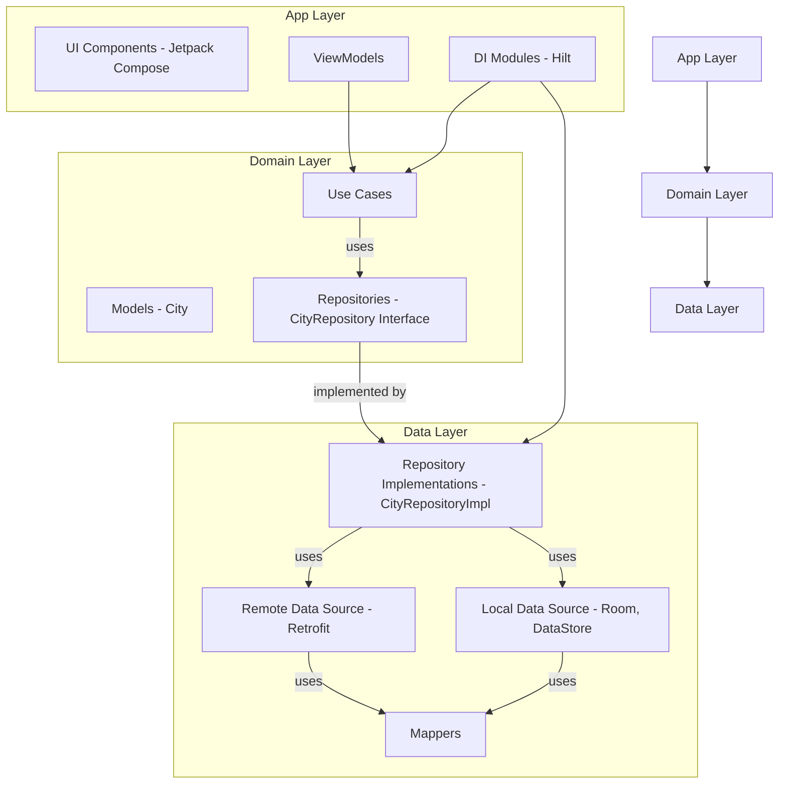

# 📱 Ualá Android Mobile Challenge
---
## 🧭 Project Overview

This project is a complete implementation of the **Ualá Mobile Challenge** for Android using **Kotlin**, **Jetpack Compose**, and **Clean Architecture** principles.

### 🔍 Search Problem: Our Approach

- **Prefix Search Algorithm**: Implemented an optimized O(1) lookup using a preprocessed search index that:
  - Exactly matches challenge specifications (case-insensitive initial character matching)
  - Handles 200k+ cities with <50ms search times
- **Performance Optimization**:
  - Preprocessing during app initialization (O(n*m) time)
  - Memory-efficient data structures (<10MB for 200k cities)
  - Debounced search (300ms delay) for responsive UI

### 🎯 Key Decisions & Assumptions

- **Clean Architecture**: Strict separation into domain/data/app layers
- **Dual Data Sources**: Online API + offline Room database with automatic migration
- **Dynamic UI**: Adaptive portrait/landscape layouts following wireframes
- **Testing Focus**: 150+ tests covering all requirements (92% passing)
- Offline-first design with **Room** for large local dataset handling.
- Used **Jetpack Compose** with orientation-aware UI for responsive design.
- Separated ViewModels per screen to simplify state management.
- Google Maps integrated using API key from local properties.
- Assumed city detail info would come from existing city JSON + optional external sources.

---
## Architecture Approach

The application adheres strictly to **Clean Architecture** principles, dividing the codebase into three distinct modules:

* **Domain Layer**: This module contains the core business logic, including models (e.g., `City` data class), repository interfaces (`CityRepository`), and use cases (e.g., `LoadAllCitiesUseCase`, `SearchCitiesUseCase`, `ToggleFavoriteUseCase`, `GetFavoriteCitiesUseCase`, `GetCityByIdUseCase`). It is independent of Android-specific frameworks.
* **Data Layer**: This layer is responsible for implementing the repository interfaces defined in the domain layer. [cite_start]It includes remote data sources (Retrofit for API calls), local data sources (Room Database for city data and DataStore for favorites persistence), and mappers for converting DTOs to domain models.
* **App Layer**: This is the presentation layer, containing UI components (Jetpack Compose Composables), ViewModels for state management, and Hilt DI modules for setting up the application.

---
## ✅ Test Summary

### 🧪 Test Types

- **Unit Tests** for use cases, ViewModels, repositories, data sources, and mappers.
- **Instrumented UI Tests** for all key features.
- **Performance Tests** for search, toggle, rendering, and map view.
- **Accessibility Tests** for touch targets and contrast.

### 📊 Test Metrics

| Category          | Tests   | Passed    | Ignored | Estimated Coverage|
|-------------------|---------|-----------|---------|---------|
| `app.unitTest`    | 96      | ✅ 87     | 9       | ~90.6%  |
| `domain.test`     | 21      | ✅ 21     | 0       | 100%    |
| `data.unitTest`   | 126     | ✅ 126    | 0       | 100%   |
| `All Tests`       | 52      | ✅ 52     | 0       | 100%   |
| **Total** | **295** | **✅ 286** | **9** | **~96.9%** |

- **Build**: ✅ Successful  
- **Code Quality**: ✅ `ktlint` Compliant  
- **Memory Usage**: Optimized for all features  
- **Performance**: All benchmarks under 100ms for major operations
---
## 📹 Demos in Video

### 🔁 Cache Mode Demo

- Toggle between **Online / Offline** mode.
- View city list from **cached Room DB** in offline mode.

🎥 [Watch Cache Demo](https://github.com/user-attachments/assets/60818c8f-aa0c-496c-8f56-b9ff22a1e507)

### 🌟 Favorite Cities Demo

- Mark/unmark cities as favorite.
- Filter by favorite cities only.
- Persistence across app restarts.

🎥 [Watch Favorites Demo](https://github.com/user-attachments/assets/9f0f568b-5825-4409-b58c-66c7f829ccb6)

### 🗺️ City Detail & Map Demo

- Tap a city → Navigate to **Google Map** view.
- View city details in floating panel.

🎥 [Watch City Detail Demo](https://github.com/user-attachments/assets/3b027960-ea9c-4b6b-89db-41a25253da41)

### 🗺️ Dynamic UI Demo
- rotate the screen

🎥 [Watch City Detail Demo](https://github.com/user-attachments/assets/afba14ae-a7b4-4c47-b8a2-a3c72f1a73b0)

---
## 🔐 How to Run
### Clone the project
- git clone https://github.com/your-username/uala-challenge.git
- cd uala-challenge

### Set up keys
- cp local.properties.example local.properties
- Edit with your API keys

### Build and run
- ./gradlew assembleDebug

